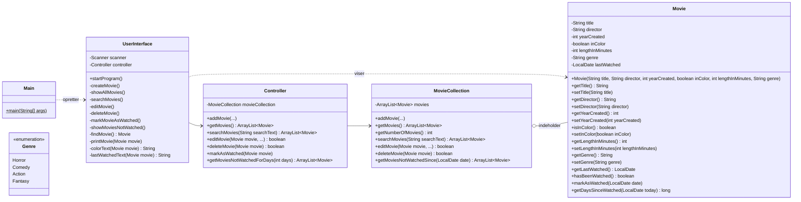

# Klassediagram – Filmsamling

```mermaid
classDiagram
    direction LR

    class Main {
        +main(String[] args)$
    }

    class UserInterface {
        -Scanner scanner
        -Controller controller
        +startProgram()
        -createMovie()
        -showAllMovies()
        -searchMovies()
        -editMovie()
        -deleteMovie()
        -markMovieAsWatched()
        -showMoviesNotWatched()
        -findMovie() Movie
        -printMovie(Movie movie)
        -colorText(Movie movie) String
        -lastWatchedText(Movie movie) String
    }

    class Controller {
        -MovieCollection movieCollection
        +addMovie(...)
        +getMovies() ArrayList~Movie~
        +searchMovies(String searchText) ArrayList~Movie~
        +editMovie(Movie movie, ...) boolean
        +deleteMovie(Movie movie) boolean
        +markAsWatched(Movie movie)
        +getMoviesNotWatchedForDays(int days) ArrayList~Movie~
    }

    class MovieCollection {
        -ArrayList~Movie~ movies
        +addMovie(...)
        +getMovies() ArrayList~Movie~
        +getNumberOfMovies() int
        +searchMovies(String searchText) ArrayList~Movie~
        +editMovie(Movie movie, ...) boolean
        +deleteMovie(Movie movie) boolean
        +getMoviesNotWatchedSince(LocalDate date) ArrayList~Movie~
    }

    class Movie {
        -String title
        -String director
        -int yearCreated
        -boolean inColor
        -int lengthInMinutes
        -String genre
        -LocalDate lastWatched
        +Movie(String title, String director, int yearCreated, boolean inColor, int lengthInMinutes, String genre)
        +getTitle() String
        +setTitle(String title)
        +getDirector() String
        +setDirector(String director)
        +getYearCreated() int
        +setYearCreated(int yearCreated)
        +isInColor() boolean
        +setInColor(boolean inColor)
        +getLengthInMinutes() int
        +setLengthInMinutes(int lengthInMinutes)
        +getGenre() String
        +setGenre(String genre)
        +getLastWatched() LocalDate
        +hasBeenWatched() boolean
        +markAsWatched(LocalDate date)
        +getDaysSinceWatched(LocalDate today) long
    }

    class Genre {
        <<enumeration>>
        Horror
        Comedy
        Action
        Fantasy
    }

    Main ..> UserInterface : opretter
    UserInterface --> Controller
    UserInterface ..> Movie : viser
    Controller --> MovieCollection
    MovieCollection o-- Movie : indeholder
```