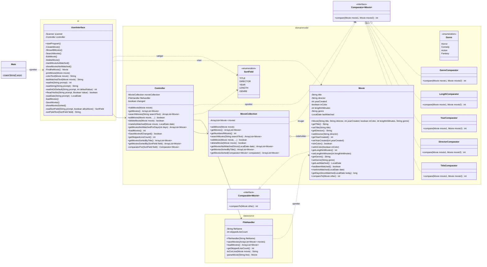

# Klassediagram – Filmsamling

Klasserne er delt i tre packages: `ui`, `domainmodel` og `datasource`. `Main` ligger uden package.

```mermaid
classDiagram
    direction LR

    class Main {
        +main(String[] args)$
    }

    namespace ui {
        class UserInterface {
            -Scanner scanner
            -Controller controller
            +startProgram()
            -CreateMovie()
            -ShowAllMovies()
            -SearchMovies()
            -EditMovie()
            -DeleteMovie()
            -markMovieAsWatched()
            -showMoviesNotWatched()
            -FindtheMovie() Movie
            -printMovie(Movie movie)
            -colorText(Movie movie) String
            -lastWatchedText(Movie movie) String
            -readInt(String prompt) int
            -readString(String prompt) String
            -readIntOrDefault(String prompt, int defaultValue) int
            +ReadYesNo(String prompt, Boolean Value) boolean
            -readDate(String prompt) LocalDate
            -loadMovies()
            -SaveMovies()
            -showMoviesSorted()
            -readSortField(String prompt, boolean allowNone) SortField
            -sortFieldText(SortField field) String
        }
    }

    namespace domainmodel {
        class Controller {
            -MovieCollection movieCollection
            -FileHandler filehandler
            -boolean changed
            +AddMovie(Movie movie)
            +getMovies() ArrayList~Movie~
            +searchMovies(String searchText) ArrayList~Movie~
            +editMovie(Movie movie, ...) boolean
            +deleteMovie(Movie movie) boolean
            +markAsWatched(Movie movie, LocalDate date)
            +getMoviesNotWatchedForDays(int days) ArrayList~Movie~
            +loadMovies() int
            +SaveMoviesifChanged() boolean
            +getSkippedLineCount() int
            +getMoviesSortedByTitle() ArrayList~Movie~
            +getMoviesSortedBy(SortField field) ArrayList~Movie~
            -comparatorFor(SortField field) Comparator~Movie~
        }

        class MovieCollection {
            -ArrayList~Movie~ movies
            +addMovie(Movie movie)
            +getMovies() ArrayList~Movie~
            +getNumberofMovies() int
            +searchMovies(String searchText) ArrayList~Movie~
            +editMovie(Movie movie, ...) boolean
            +deleteMovie(Movie movie) boolean
            +getMoviesNotWatchedSince(LocalDate date) ArrayList~Movie~
            +getMoviesSortedByTitle() ArrayList~Movie~
            +getMoviesSorted(Comparator~Movie~ comparator) ArrayList~Movie~
        }

        class Movie {
            -String title
            -String director
            -int yearCreated
            -boolean inColor
            -int lengthInMinutes
            -String genre
            -LocalDate lastWatched
            +Movie(String title, String director, int yearCreated, boolean inColor, int lengthInMinutes, String genre)
            +getTitle() String
            +setTitle(String title)
            +getDirector() String
            +setDirector(String director)
            +getYearCreated() int
            +setYearCreated(int yearCreated)
            +isInColor() boolean
            +setInColor(boolean inColor)
            +getLengthInMinutes() int
            +setLengthInMinutes(int lengthInMinutes)
            +getGenre() String
            +setGenre(String genre)
            +getLastWatched() LocalDate
            +hasBeenWatched() boolean
            +markAsWatched(LocalDate date)
            +getDaysSinceWatched(LocalDate today) long
            +compareTo(Movie other) int
        }

        class Genre {
            <<enumeration>>
            Horror
            Comedy
            Action
            Fantasy
        }

        class SortField {
            <<enumeration>>
            TITLE
            DIRECTOR
            YEAR
            LENGTH
            GENRE
        }

        class TitleComparator {
            +compare(Movie movie1, Movie movie2) int
        }
        class DirectorComparator {
            +compare(Movie movie1, Movie movie2) int
        }
        class YearComparator {
            +compare(Movie movie1, Movie movie2) int
        }
        class LengthComparator {
            +compare(Movie movie1, Movie movie2) int
        }
        class GenreComparator {
            +compare(Movie movie1, Movie movie2) int
        }
    }

    class Comparable~Movie~ {
        <<interface>>
        +compareTo(Movie other) int
    }

    class Comparator~Movie~ {
        <<interface>>
        +compare(Movie movie1, Movie movie2) int
    }

    namespace datasource {
        class FileHandler {
            -String fileName
            -int skippedLineCount
            +FileHandler(String fileName)
            +saveMovies(ArrayList~Movie~ movies)
            +loadMovies() ArrayList~Movie~
            +getSkippedLineCount() int
            -toCsvLine(Movie movie) String
            -parseMovie(String line) Movie
        }
    }

    Main ..> UserInterface : opretter
    UserInterface --> Controller
    UserInterface ..> Movie : viser
    Controller --> MovieCollection
    Controller --> FileHandler
    MovieCollection o-- Movie : indeholder
    FileHandler ..> Movie : opretter

    UserInterface ..> SortField : vælger
    Controller ..> SortField
    Controller ..> Comparator~Movie~ : opretter
    MovieCollection ..> Comparator~Movie~ : bruger
    Comparable~Movie~ <|.. Movie
    Comparator~Movie~ <|.. TitleComparator
    Comparator~Movie~ <|.. DirectorComparator
    Comparator~Movie~ <|.. YearComparator
    Comparator~Movie~ <|.. LengthComparator
    Comparator~Movie~ <|.. GenreComparator
```
